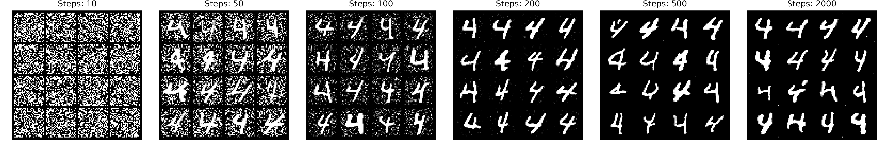
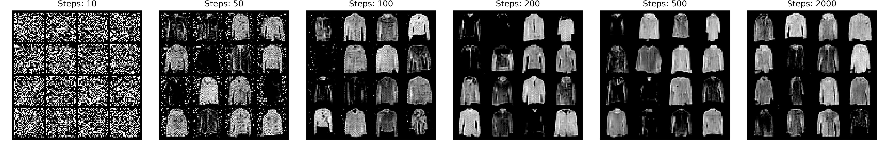
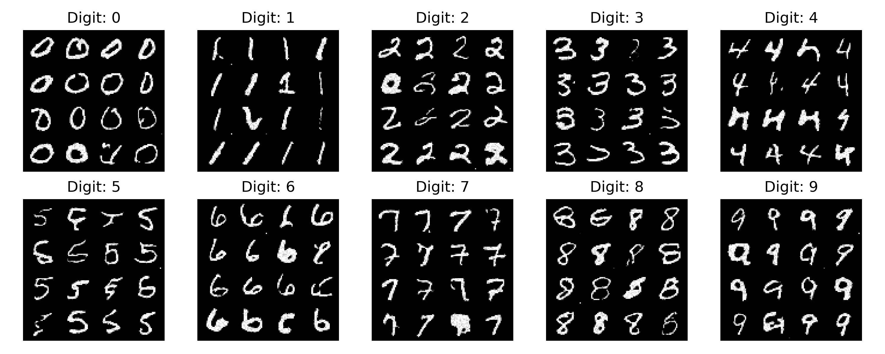
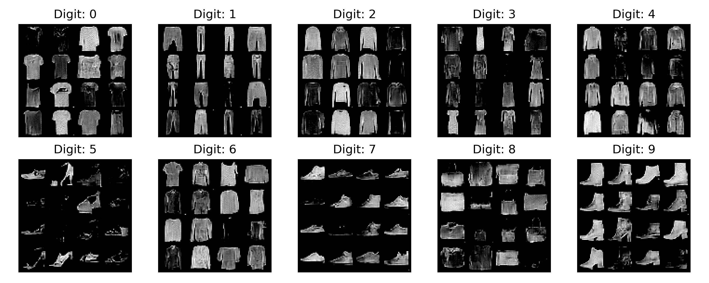

# Diffusion Model
The model is a **Conditional Denoising Diffusion Probabilistic Model (DDPM)** built as a U-Net with **Spatial Transformer blocks**. Its goal is to learn to predict the noise added to an image according to a diffusion process.

---

## Diffusion from scratch
<p float="left">
  
   
</p>

<p float="left">
  
   
</p>

---

## Architecture:
1. **GaussianFourierProjection**  
   Converts the continuous diffusion timestep `t` into a high-dimensional embedding `[B, embed_dim]`. This embedding conditions the network at each layer on the current diffusion step, similar to positional encoding in Transformers.

2. **Class Embedding** (`nn.Embedding`)  
   Encodes the class label (e.g., MNIST digits 0–9) into a vector `[B, text_dim]`. This serves as a context for cross-attention in the Transformer blocks.

3. **Encoder** (Conv2d → Dense(time_embed) → GroupNorm → GELU)  
   Extracts local features and reduces dimensionality while conditioning on the timestep embedding.

4. **Spatial Transformer blocks**  
   - Input feature maps `[B, C, H, W]` are flattened into token sequences `[B, H*W, C]`.  
   - **Self-attention:** Each token attends to all other tokens in the same feature map.  
   - **Cross-attention:** Tokens attend to the class embedding as context.  
   - **Feed-forward network (MLP):** Enhances token representations non-linearly.  
   - **Residual connections:** Maintain stability during training.  
   Output is reshaped back to `[B, C, H, W]` with global contextual information integrated.

5. **Decoder** (ConvTranspose + skip connections)  
   Reconstructs the image from enriched features. Skip connections from the encoder preserve spatial details. Timestep embeddings are added to decoder layers to maintain temporal conditioning. Output is `[B, 1, H, W]` for MNIST images.

---

## Training
For each image in a batch:

1. Sample a random timestep `t ∈ [ε, 1]` to train the model across all levels of diffusion.
2. Generate Gaussian noise `z`.  
3. Perturb the image: `x_t = x_0 + σ(t) * z`, where `σ(t)` is computed via `marginal_prob_std(t)` (VE SDE forward process).  
4. Input `x_t`, timestep `t`, and class label `y` into the U-Net + Spatial Transformers:
   - Convolutions extract local features.
   - Dense layers inject timestep embeddings.
   - Spatial Transformer blocks integrate global spatial information with optional class conditioning.  
5. The model predicts `-z` (the noise to remove). Multiply the predicted score by `σ(t)` for correct scaling.
6. Loss: Mean Squared Error (MSE) between `score * σ(t)` and `-z`, averaged over batch, channels, height, and width.

This trains the model to denoise images at all noise levels, enabling stable generative performance.

---

## Inference
To generate images:

1. Start from pure noise: `x ~ N(0, σ(1)^2)`.  
2. Iteratively apply the **reverse diffusion process**:
   - At each timestep `t_i`, predict noise: `ε_θ(x, t_i, y)`.  
   - Update the image using a numerical SDE solver (e.g., Euler-Maruyama).  
3. Output is the generated image `[B, C, H, W]`.

---

## Key Modules

### GaussianFourierProjection
Transforms scalar timesteps into high-dimensional embeddings using sinusoidal functions:
- Allows the network to interpret the timestep `t` continuously.
- Analogous to positional encodings in Transformers.
- Ensures the model can handle any timestep, not just discrete ones.

Output: `[B, embed_dim]`, concatenating sine and cosine functions for rich temporal features.

### FullyConnected
Projects timestep embeddings into the appropriate number of channels for convolutional feature maps:
- Input `[B, embed_dim]`.
- Output `[B, channels, 1, 1]` for broadcasting over `[B, C, H, W]` feature maps.
- Integrates timestep information into every pixel.

### CrossAttention
Implements self- or cross-attention for token sequences:
- Self-attention: Tokens attend to all other tokens in the same feature map.  
- Cross-attention: Tokens attend to external context, e.g., class embeddings.  
- Output maintains token dimension `[B, seq_len, hidden_dim]`.
- After SpatialTransformer, tokens are reshaped back into `[B, C, H, W]`.

### Transformer
A standard Transformer block adapted for 2D feature map tokens:
- Self-attention: captures spatial dependencies.  
- Cross-attention: conditions on class embeddings.  
- Feed-forward network: adds non-linear capacity.  
- Helps the model predict the noise score accurately by integrating local and global information.

### SpatialTransformer
Applies the Transformer to 2D feature maps:
1. Flatten `[B, C, H, W] → [B, H*W, C]`.
2. Apply Transformer with self- and cross-attention.
3. Reshape back to `[B, C, H, W]`.
4. Residual connection ensures stability.
- Enriches features with global spatial and class context for better noise prediction.

### Diffusion Functions

#### diffusion_coeff
Computes the diffusion coefficient `g(t)` for the SDE:
- Controls how much noise is added at each step.
- Larger `t` → larger `g(t)` → more noise added.

#### marginal_prob_std
Computes the marginal standard deviation `σ(t)` of `x_t` in the forward VE-SDE:
- Ensures the model predicts noise relative to the correct noise level.
- Normalizes predictions for all timesteps.

### Loss
The model predicts the noise `-z` added to `x_0` to produce `x_t`:
- Forward process: `x_t = x_0 + σ(t) * z`, `z ~ N(0, I)`.
- Loss: `MSE(score * σ(t), -z)`.
- Random timestep sampling ensures the model learns to denoise across the entire diffusion trajectory.

---

## How to train
```bash
https://github.com/claudiocamolese/generative-AI.git #clone repository
cd generative-AI
```
```python
# in the command line run
python main.py --train --test --dm <optional>--track# you can just use train/test flag
```

### Model architecture image
